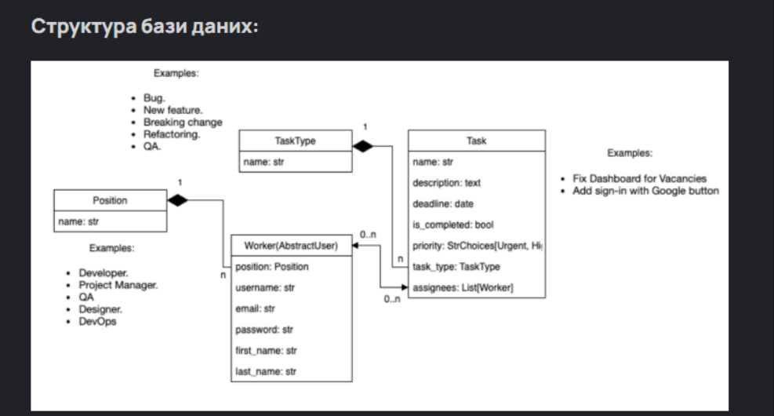

# Task Manager

Task Manager is a web application built with Django that allows users to manage tasks with priorities, statuses, and deadlines.

## Live Demo
https://task-managers-fcrq.onrender.com/

## Test Credentials
Login: admin  
Password: admin

## Features
- User authentication
- Custom user model
- View all tasks
- Personal "My Tasks" page
- Task statuses: Pending / Completed
- Task priorities
- Pagination
- Sidebar navigation
- Django Admin panel

## Database Schema
The database structure was designed before implementing the models.



## Main Entities
- Worker — system user
- Task — task entity
- TaskType — task category (Bug, Feature, QA, etc.)
- Position — user role (Developer, Manager, QA)

## Tech Stack
- Python 3
- Django
- SQLite
- Bootstrap 4
- django-crispy-forms
- HTML / CSS

## Run Locally

```bash
git clone https://github.com/n-korobko/Task-Managers.git
cd Task-Managers
python -m venv venv
source venv/bin/activate  # Windows: venv\Scripts\activate
pip install -r requirements.txt
python manage.py migrate
python manage.py createsuperuser
python manage.py runserver

